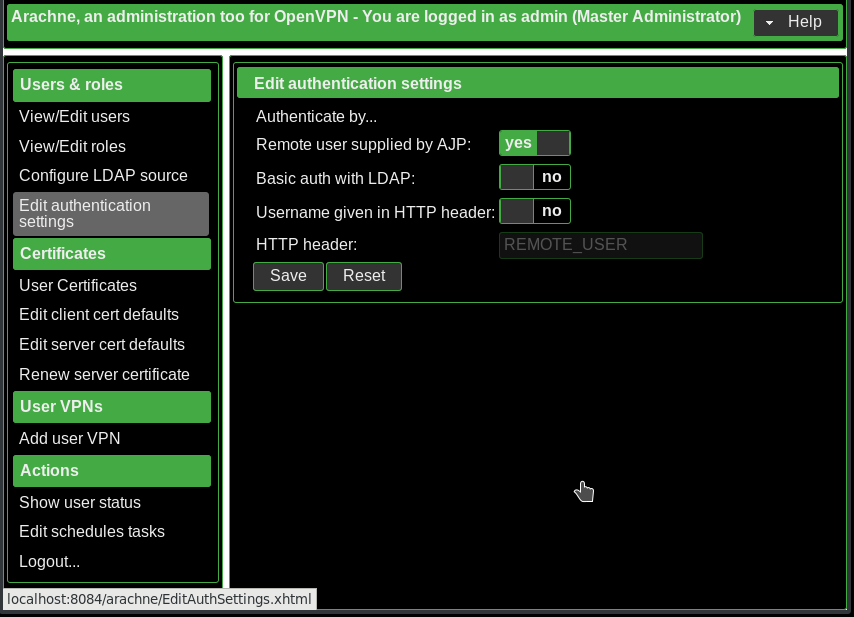

# Usermanagement

## Roles

There are two roles: admin and user. An admin can modify any settings, an user
is allowed to connect via openvpn. A user may have both roles.

## Authentication sources

If you have external authentication sources, enable them here.

 - **Remote user supplied by AJP**: Select if you have setup an Apache HTTP server
   that acts as an AJP proxy to your tomcat.

 - **Basic auth with LDAP**: Enables internal LDAP authication, requires LDAP
   setup. If your tomcat runs behind an Apache HTTP server, unselect this
   option and select *Remote user supplied by AJP*.

 - **Username given in HTTP header**: Select if your tomcat runs behind an
   Apache HTTP server and provide your desired *HTTP header*.

   > Please note: This option might be unsecure. Please make sure that your web server overrides the header if provided by the client.

## Local users

TBW

## Define LDAP source

Arachne can authenticate against a LDAP server. It's also possible to manage
roles with LDAP groups.

 - managing roles with LDAP groups

 - authenticating against LDAP server

 - getting user attributes for external authentication (e.g. Apache HTTP
   server)

## Authentication by remote user with Kerberos

The following examplme describes how to setup Apache HTTP server on CentOS
assuming the host is member of a [FreeIPA](https://www.freeipa.org/page/Main_Page)
domain. Microsoft ActiveDirectory may also work, the way howto get the keytab
and SSL certificate is different. Other authentication mechanisms like SAML may
also work.

We assume, that server's FQDN is openvpn.example.

 1. Configure Apache

    1. Install packages
       > `sudo yum install httpd mod_nss mod_auth_kerb`

    1. Copy sample configuration to HTTP configuration folder
       > `sudo cp /usr/share/doc/arachne/arachne.conf /etc/httpd/conf.d`

    1. Create service on FreeIPA server and install keytab
       > `
ipa service-add HTTP/$HOSTNAME
ipa-getkeytab -k /tmp/httpd.keytab -p HTTP/$HOSTNAME
sudo mv -v /tmp/httpd.keytab /etc/httpd/krb5.keytab
sudo chown -v apache /etc/httpd/krb5.keytab
`

    1. Make HTTPD server listen on port 443 enstead of 8443
       >`sudo sed -i 's/8443/443/' /etc/httpd/conf.d/nss.conf`

    1. Restore selinux context
       > `sudo restorecon -Rv /etc/httpd`

    1. Restart and enable HTTP server
       >`
sudo systemctl start httpd
sudo systemctl enable httpd
`

  1. Configure Tomcat

     1. Disable authentication in Tomcat. If authenticatian is enabled - which
        is the default -, Tomcat will ignore the remote user supplied by Apache.

        > `
sudo sed -i \
    's/Connector port="8009" protocol="AJP\\/1.3"/\Connector port="8009" protocol="AJP\\/1.3" tomcatAuthentication="false"/' \
    /etc/tomcat/server.xml`

     1. Restart Tomcat

        > `sudo systemctl start tomcat`

