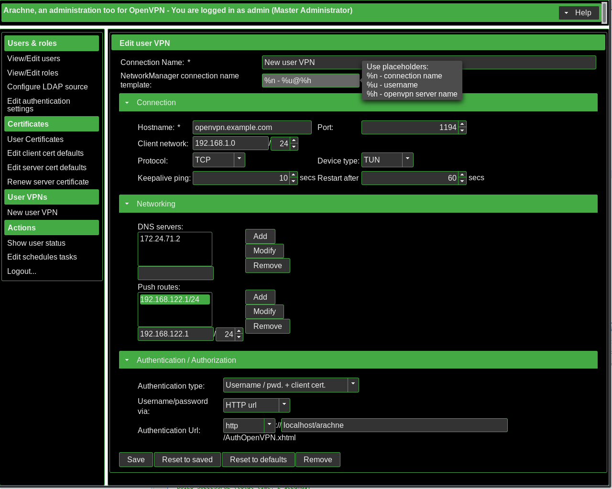

# VPN settings

## Setup user VPN

## Starting openVPN for the first time

 1. disable selinux

 1. start openvpn with arachne configuration and enable start on system boot

    > `
systemctl start openvpn-server@arachne_uservpn
systemctl enable openvpn-server@arachne_uservpn
`
