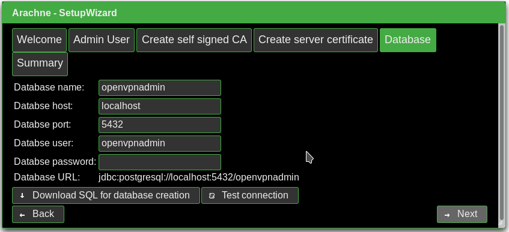

# Initial setup

In the following steps replace arachne.example.com with your arachne server's
full qualified domain name.

 1. Start tomcat
    ```
    systemctl start tomcat
    ```

 1. Open arachne in Mozilla Firefox or in your favorite web browser
    ```
    firefox http://arachne.example.com:8080/arachne
    ```

 1. Enjoy arachne setup wizard's welcome page
    


 1. Set name of master adminitrative user and password.
    


 1. Create a self signed CA, that will create certificates for the openvpn
    server and VPN users
    


 1. Create openvpn server certificate. The common name must be the full
    qualified domain name (FQDN) of your openvpn server as visible from
    the internet.
    


 1. Arachne stores its settings and certificate in a postgresql database.
    Set username etc. here.
    

    You can download a SQL file that contains everything to create a database
    user and an empty database. A hash of the password you've entered here is
    also included.

    To enable md5 authentication on your postgres server, add the following
    line to */var/lib/pgsql/data/pg_hba.conf*:
    ```
    host    openvpnadmin     openvpnadmin     127.0.0.1/32    md5
    ```

    You can test the database connectivity by clicking *Test connection*.


 1. To finalize setup click "finish" on the last page. Arachne will create
    the administrator user, your CA, a server certificate, DH paramers and
    all neccasary database tables and initial values.

    

    This step takes a couple of minutes.


 1. When the login screen appears enter username and passwd for the user
    you've just created.

    

